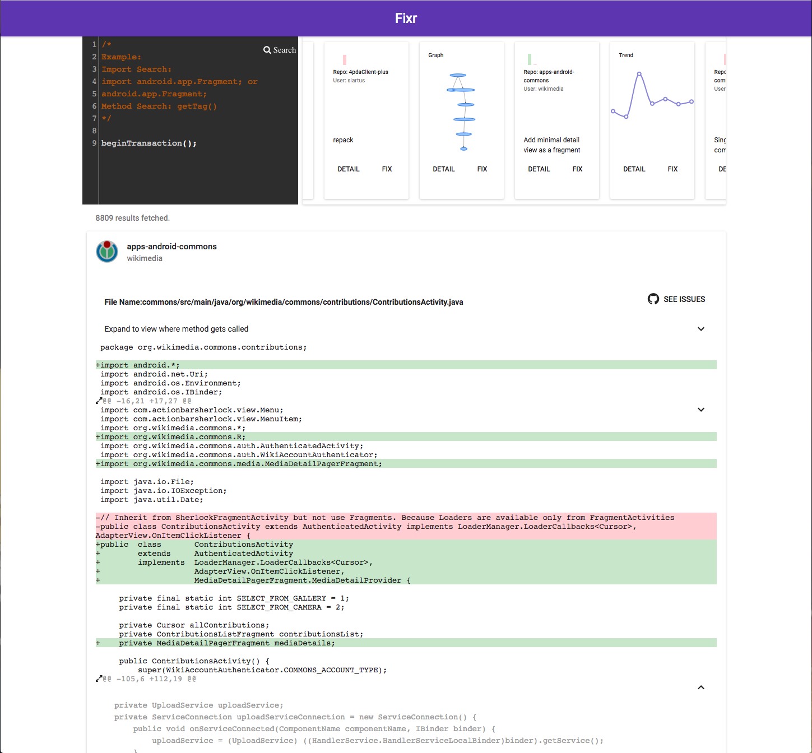

# Solr Relevant Commit Search

This application helps user to find relevant commit that fix a specific bug in Android development by refining search parameters.

## First Time Setup
If you already have npm and node installed, you can skip this step.
For Ubuntu:
```
$sudo apt-get update
$sudo apt-get install nodejs
$node -v
$sudo apt-get install npm
$npm -v
```
For Mac:
 
1. Open the Terminal app and type `brew install node`.
2. Sit back and wait. Homebrew downloads some files and installs them. And that’s it.

## Running

- Compile:
```
$npm run-script build-app
```

- Run with:
```
$npm start
```

## Install dependencies
If you can't run the program, try the following command to install node modules locally.
```
$npm install
```

## Searching Syntax:

#### import search:
- android.app.Fragment;
- import android.app.Fragment;

#### method search:
- createTable(db);
- db.beginTransaction();
- beginTransaction();

By default, queries above will search both addition and deletion lines that contains these prarmeters.
Using '+' as a prefix to indicate additions only
Using '-' as a prefix to indicate deletions only
Using 'all' as a prefix to indicate all actions(neither added nor deleted)
Using '=>' as a predix to indicate full text search (will be disabed)

## Iso Graph Search

Under development

## Trending Analysis

Under development



## Deployment
Tool is deployed at http://192.12.243.***:8080/.
